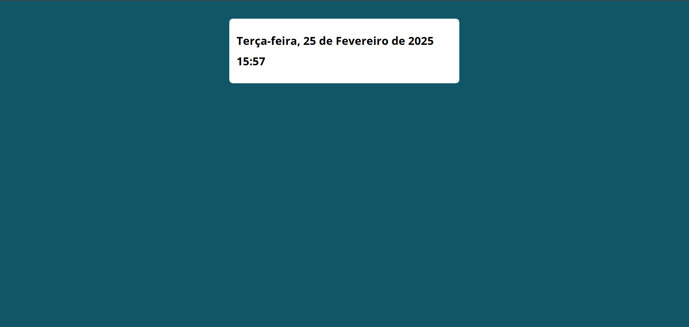

# Projeto Site: Data e Hora

Esse projeto foi desenvolvido como parte da lista de exercícios do curso de programação em JavaScript do professor Luiz Otávio.

# Objetivo

- Criar uma landing page que contenha o *Dia da Semana*,  *Data*, *Mês*, *Ano* e *Horário*.

# Especificações

- Contém as informações de Data no Brasil.
- Horário atualizado em tempo real (GMT-3).

# Conteúdo

