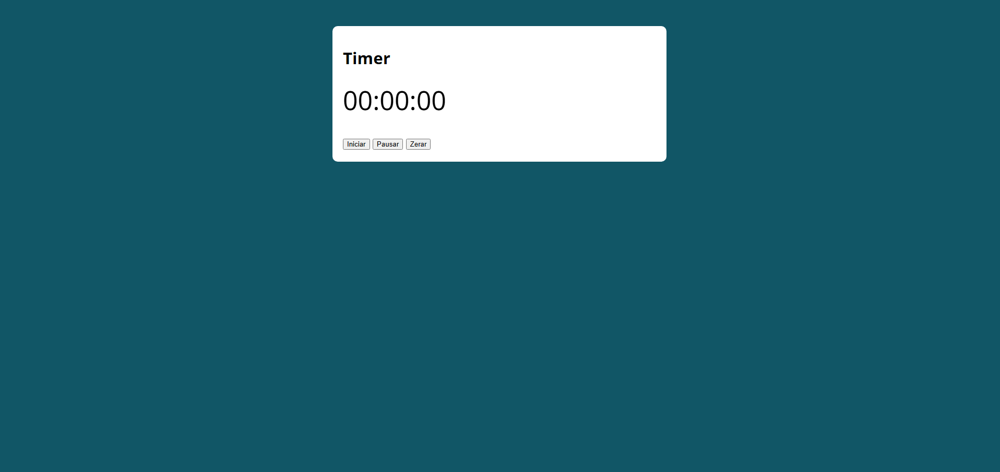

# Projeto Site: Timer

Esse projeto foi desenvolvido como parte da lista de exercícios do curso de programação em JavaScript do professor Luiz Otávio.

# Objetivo

- Criar uma landing page com um cronômetro de Horas, Minutos e Segundos.

# Especificações

- Contém botão de *Iniciar*, *Pausar* e *Zerar*.
- Relógio pausado fica em vermelho.
- Despausa no botão *Iniciar*.
- Registra até 23:59:59 horas e reseta.
- Botão *Zerar* para a contagem.

# Conteúdo

